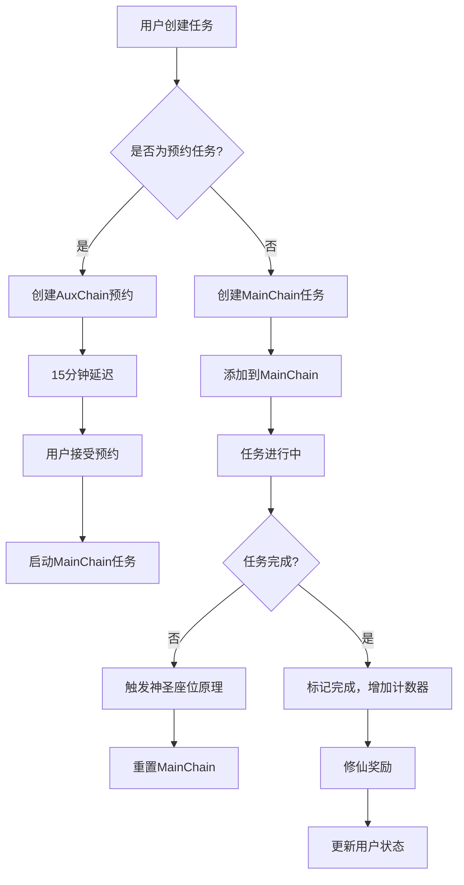

# CTDP协议实现

## 概述

CTDP（神圣座位原理）协议是项目的核心创新，基于科学自控力理论实现。该协议通过任务链管理机制，确保用户连续完成任务，任何失败都会重置进度。

## 协议名称

**CTDP** = **C**hain **T**ask **D**iscipline **P**rinciple（任务链纪律原理）

## 核心概念

### 1. 神圣座位原理 (Sacred Seat Principle)
- 连续的任务完成创造心理约束力
- 任何任务失败立即将所有进度重置为零
- 防止"破窗效应"和任务中断

### 2. 主链 (MainChain)
- 用户的主要任务链
- 包含按顺序完成的任务节点
- 任何节点失败都会重置整个链

### 3. 辅助链 (AuxChain)
- 管理预约系统
- 处理待处理的预约
- 支持任务延迟和取消

### 4. 节点级别 (Node Levels)
- **Unit**：基本任务节点
- **Group**：任务组节点（未来扩展）
- **Cluster**：任务集群节点（未来扩展）

## 协议架构

```
CTDPService
├── MainChain 管理
│   ├── 创建主链
│   ├── 添加节点
│   ├── 完成节点
│   └── 失败节点（重置）
├── AuxChain 管理
│   ├── 创建预约
│   ├── 启动预约
│   ├── 延迟预约
│   └── 取消预约
└── 协议协调
    ├── 任务状态同步
    ├── 链条状态监控
    └── 错误处理
```

## 1. MainChain - 主链管理

### 数据结构

```typescript
interface MainChainDocument {
  userId: number;          // 用户ID
  chainId: string;         // 链ID
  status: 'active' | 'broken'; // 链状态
  createdAt: Date;         // 创建时间
  updatedAt: Date;         // 更新时间

  // 节点列表
  nodes: MainChainNode[];   // 节点数组

  // 级别计数器
  levelCounters: {
    unit: number;         // 单元节点计数
    group: number;        // 组节点计数
    cluster: number;      // 集群节点计数
  };
}
```

### 节点结构

```typescript
interface MainChainNode {
  nodeNo: number;         // 节点编号
  level: 'unit' | 'group' | 'cluster'; // 节点级别
  taskId: string;         // 关联任务ID
  status: 'running' | 'completed' | 'failed'; // 节点状态
}
```

### 核心方法

#### `startMainTask(userId, input)`
启动主链任务

**参数：**
- `userId`: 用户ID
- `input`: 任务输入参数

**流程：**
1. 查找或创建活跃的MainChain
2. 调用TaskService创建底层任务
3. 确定节点编号和级别
4. 将运行节点添加到MainChain
5. 保存更新后的MainChain

**返回：** `{ mainChain, task }`

#### `completeMainTask(userId, chainId, nodeNo, taskId)`
完成主链任务

**参数：**
- `userId`: 用户ID
- `chainId`: 主链ID
- `nodeNo`: 节点编号
- `taskId`: 任务ID

**流程：**
1. 查找MainChain和指定节点
2. 调用TaskService完成底层任务（成功）
3. 更新节点状态为'completed'
4. 增加相应级别的计数器
5. 保存更新后的MainChain

**返回：** `{ mainChain, task, user, wasChainBroken, cultivationReward }`

#### `failMainTask(userId, chainId, nodeNo, reason)`
失败主链任务（触发神圣座位原理）

**参数：**
- `userId`: 用户ID
- `chainId`: 主链ID
- `nodeNo`: 节点编号
- `reason`: 失败原因

**流程：**
1. 查找MainChain和指定节点
2. 调用TaskService完成底层任务（失败）
3. 应用神圣座位原理：
   - 设置MainChain状态为'broken'
   - 清空所有节点
   - 重置所有级别计数器
4. 保存更新后的MainChain

**返回：** `{ mainChain, task, user, wasChainBroken }`

## 2. AuxChain - 辅助链管理

### 数据结构

```typescript
interface AuxChainDocument {
  userId: number;          // 用户ID
  chainId: string;         // 链ID
  status: 'active';       // 链状态
  createdAt: Date;         // 创建时间
  updatedAt: Date;         // 更新时间

  // 待处理预约
  pendingReservation?: PendingReservation;

  // 预约历史
  reservationHistory: ReservationHistory[];
}
```

### 预约结构

```typescript
interface PendingReservation {
  reservationId: string;   // 预约ID
  signal: string;         // 任务信号
  duration: number;       // 任务时长（分钟）
  createdAt: Date;        // 创建时间
  deadlineAt: Date;       // 截止时间
  status: 'pending';     // 状态
}

interface ReservationHistory {
  reservationId: string;  // 预约ID
  signal: string;         // 任务信号
  duration: number;       // 任务时长（分钟）
  createdAt: Date;        // 创建时间
  fulfilledAt?: Date;      // 完成时间
  delayedAt?: Date;       // 延迟时间
  delayMinutes?: number;  // 延迟分钟数
  status: 'pending' | 'fulfilled' | 'delayed' | 'cancelled' | 'expired'; // 状态
}
```

### 核心方法

#### `createReservation(userId, description, duration, reservationId)`
创建预约

**参数：**
- `userId`: 用户ID
- `description`: 任务描述
- `duration`: 任务时长（分钟）
- `reservationId`: 预约ID

**流程：**
1. 查找或创建活跃的AuxChain
2. 创建待处理预约
3. 设置15分钟延迟截止时间
4. 保存更新后的AuxChain

**返回：** `AuxChainDocument`

#### `startReservedTask(userId, reservationId, description, duration)`
启动预约任务

**参数：**
- `userId`: 用户ID
- `reservationId`: 预约ID
- `description`: 任务描述（可选）
- `duration`: 任务时长（可选）

**流程：**
1. 查找带有待处理预约的AuxChain
2. 调用startMainTask创建预约任务
3. 将预约从待处理移动到历史记录
4. 取消预约队列作业
5. 保存更新后的AuxChain

**返回：** `{ mainChain, task, auxChain }`

#### `delayReservation(userId, reservationId, delayMinutes)`
延迟预约

**参数：**
- `userId`: 用户ID
- `reservationId`: 预约ID
- `delayMinutes`: 延迟分钟数

**流程：**
1. 查找带有待处理预约的AuxChain
2. 重新安排预约队列作业
3. 记录延迟操作到历史记录
4. 更新预约截止时间
5. 保存更新后的AuxChain

**返回：** `{ auxChain, newJobId }`

#### `cancelReservation(userId, reservationId)`
取消预约

**参数：**
- `userId`: 用户ID
- `reservationId`: 预约ID

**流程：**
1. 查找带有待处理预约的AuxChain
2. 取消预约队列作业
3. 将预约标记为已取消并添加到历史记录
4. 清除待处理预约
5. 保存更新后的AuxChain

**返回：** `{ auxChain, queueCancelled, cancelled }`

#### `expireReservation(reservationId)`
过期预约

**参数：**
- `reservationId`: 预约ID

**流程：**
1. 查找带有待处理预约的AuxChain
2. 将预约标记为过期并添加到历史记录
3. 清除待处理预约
4. 保存更新后的AuxChain

**返回：** `{ expired: boolean, auxChain: AuxChainDocument | null }`

## 3. 协议协调机制

### 任务状态同步
- MainChain节点状态与底层任务状态同步
- AuxChain预约状态与队列作业状态同步
- 状态变化时的协调处理

### 链条状态监控
- 监控MainChain状态变化
- 检测链条破坏事件
- 触发相应的用户通知

### 错误处理
- 处理数据库操作错误
- 回滚不完整的事务
- 记录错误日志

## 协议流程图



## 协议特点

### 1. 心理约束力
- 连续任务完成创造心理约束力
- 防止任务中断和拖延

### 2. 即时反馈
- 任务失败立即重置进度
- 强烈的负面反馈机制

### 3. 灵活预约
- 15分钟延迟降低启动阻力
- 支持任务延迟和取消

### 4. 可扩展性
- 支持节点级别扩展
- 易于添加新的协议功能

### 5. 数据完整性
- 事务性操作确保数据一致性
- 完善的错误处理机制

## 协议优势

### 对用户
- 强制连续任务完成
- 建立良好的习惯
- 提高自控力

### 对系统
- 简化状态管理
- 易于实现和维护
- 良好的可扩展性

## 协议实现考虑

### 1. 性能优化
- 数据库索引优化
- 批量操作支持
- 缓存策略

### 2. 可靠性
- 事务支持
- 错误恢复机制
- 日志记录

### 3. 可测试性
- 单元测试覆盖
- 集成测试
- 协议验证测试

### 4. 监控和日志
- 状态变化监控
- 错误日志
- 性能指标

## 协议未来扩展

### 1. 节点级别扩展
- 实现Group和Cluster级别
- 更复杂的进度管理

### 2. 协议参数化
- 可配置的延迟时间
- 可调整的重置策略

### 3. 协议分析
- 用户行为分析
- 协议效果评估
- 优化建议

### 4. 协议集成
- 与其他系统集成
- 跨平台支持
- 数据同步

## 协议文档

### 协议规范
- 详细的协议描述
- 实现指南
- 最佳实践

### 测试文档
- 测试用例
- 测试策略
- 质量保证

### 用户文档
- 协议说明
- 使用指南
- 故障排除指南

## 协议维护

### 版本管理
- 协议版本控制
- 向后兼容性
- 迁移指南

### 社区贡献
- 开源协议
- 社区反馈
- 持续改进

### 持续改进
- 基于用户反馈的改进
- 新研究成果的集成
- 协议优化建议